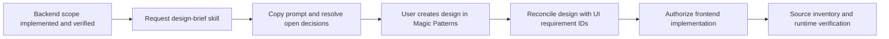

# Agentic development prompt cookbook

Copy the example closest to your task and replace bracketed placeholders. State
the outcome and important boundaries; repository instructions already supply
the normal engineering procedure. See the [handbook](./agentic-workflow-handbook.md)
for flow diagrams and the [development reference](./agentic-development.md) for
commands. A skill invocation does not authorize unrelated implementation,
external writes, or product decisions.

## Backend first, then design, then frontend

Use three explicit handoffs. You can consider the user journey before building
the backend, but generate the detailed design prompt from actual supported
behavior afterward. This prevents a designer from promising actions that the
backend cannot perform.



### 1. Deliver the backend scope

```text
Create a feature using the full feature lifecycle: [backend feature name].
User outcome: [what the eventual UI must let the user accomplish].
Implement backend scope only: [actions, contracts, permission and failure rules].
Acceptance: [observable backend success and failure cases].
Frontend implementation is excluded from this feature's acceptance scope.
Verify backend behavior and complete its required review and local Git workflow.
Afterward, use $design-brief to prepare a Magic Patterns prompt for the future UI.
Save it in docs/design-prompt/[feature-slug].md with links to the feature
specification, implementation plan, relevant ADRs, and source evidence.
Link it from the current plan.
Do not call Magic Patterns, implement the frontend, or claim the UI is complete.
```

Only use the backend-only exclusion when that really is the intended feature
scope. If an existing feature already promises an end-to-end UI, a design brief
does not satisfy its frontend acceptance criteria or permit marking it complete.

### 2. Generate a brief for an already implemented feature

```text
Use $design-brief for [feature directory or correction/improvement record].
Inspect the implemented contracts, domain rules, permissions, relevant tests,
and existing app navigation. Target screen/entry point: [route or region].
Design system reference: [Magic Patterns system link or attached reference].
Return a self-contained copyable prompt with very short app context, fuller
feature explanation, supported user journeys, required controls and states,
and practical UX recommendations. Include a source-grounded UI checklist with
stable IDs. Separate supported requirements, recommendations, and open decisions.
Do not call Magic Patterns or modify application code. Save the brief in
docs/design-prompt/[feature-slug].md and return its link.
```

Briefs are saved by default in [docs/design-prompt](./design-prompt/README.md),
with links to their dedicated feature/implementation records, applicable ADRs,
and source evidence outside the copyable prompt. This is a supporting design
artifact, not another required feature lifecycle file. Say “response only; do
not edit files” to opt out, or give a specific path to override the location.
If the system reference is unavailable, the agent should identify that missing
input rather than invent colors, typography, or claims of design-system fidelity.

The copyable prompt contains user-facing facts, not local paths or private code.
The companion checklist retains provenance. A useful row tells you which user
requirement is supported by which source, its relevant UI states, and how it
should eventually be checked in both the design and running application.

### 3. Update a brief after a correction

```text
Use $design-brief to update [existing brief path] after [correction record/diff].
Inspect the changed behavior; keep unaffected UI IDs and requirements stable.
Update the saved full prompt/checklist, retaining current source links, and
include changed checklist rows and a short delta prompt for Magic Patterns.
Identify any designs or states now invalidated. Do not redesign unrelated areas
or call Magic Patterns. If no user-visible behavior changed, explain why no
design update is needed.
```

Examples that merit a delta: new validation feedback, changed permissions,
asynchronous status changes, or different failure recovery. Internal refactoring
with the same contract normally does not. Never reuse a retired ID for a
different requirement.

### 4. Check the returned design before implementation

```text
Compare [Magic Patterns design link/export] against [design brief and UI IDs].
Review only; do not implement or write to Magic Patterns.
Identify missing controls, unsupported actions, unclear interactions, and absent
responsive/empty/loading/error/permission states where applicable.
Map each requirement ID to a design section or an explicit gap. Distinguish
required corrections from optional UX suggestions. Do not approve deviations
that change product behavior on my behalf.
```

If source access is missing, provide an export or accessible reference. An agent
cannot establish fidelity from an inaccessible design or a single screenshot
that omits the required interaction states.

### 5. Implement the designed frontend

```text
Create a feature using the full feature lifecycle for the frontend of
[implemented backend feature]. Use [design link/export] and [brief path].
Integrate the supplied design through the available Magic Patterns integration
workflow. Preserve the UI requirement IDs and build a source-state inventory
before coding. Use existing backend contracts and app UI conventions.
Do not invent backend behavior or silently remove designed controls.
Verify matched reference/runtime states and the supported user journeys.
Surface any new capability or material product decision before expanding scope.
Do not write to Magic Patterns or push code.
```

This example explicitly requests a feature for a new frontend journey. If work
only restyles an existing journey with unchanged contracts, request the
improvement flow instead. MCP access is a transport mechanism, not permission to
modify a remote design or proof that all states have been inspected.

## Small correction

```text
Correct [existing behavior or copy] on [route/file].
Current: [observation]. Expected: [established behavior].
Keep [important unaffected behavior] unchanged. Use the correction flow,
focused regression checks, and required rendered verification for visible UI.
Do not commit or expand scope.
```

## Clear bug: diagnose and fix

```text
Fix [symptom] in [surface]. Reproduce with [minimal steps/command, fake data].
Actual: [result]. Expected: [existing contract].
Evidence: [redacted log, failing test, or screenshot].
Find the cause, add the smallest reliable regression test where practical,
and verify the original reproduction. Avoid unrelated refactors.
Ask before crossing a feature boundary. Do not commit.
```

## Unclear bug: diagnosis only

```text
Diagnose [symptom] under [conditions and observed frequency].
Use [redacted evidence/reproduction] and [last known working state if known].
Do not edit files or implement a fix. Report the causal chain, supporting and
contradicting evidence, confidence, and smallest proposed fix/verification.
```

“Diagnose” and “review” do not authorize implementation. When you want both,
say “diagnose and fix,” with an expected behavior that constrains the fix.

## Focused improvement

```text
Use the improvement flow to improve [tooling, internal code, or existing UX].
Outcome: [observable benefit]. In scope: [bounded surfaces].
Preserve [contracts/behavior]. Exclude [new capabilities/unrelated refactors].
Use proportional checks and risk-based independent review. Do not commit.
```

## Full feature

```text
Create a feature using the full feature lifecycle: [name].
Users should be able to [journey]. Acceptance: [success, failure, permissions].
In scope: [boundaries]. Out of scope: [exclusions]. Context: [relevant paths].
Continue through verification, author preflight, independent completion review,
remediation, and the required local squash merge. Do not push or delete branches.
Ask for material product/safety decisions, not routine milestone approval.
```

## Explore alternatives without starting delivery

```text
Explore how [behavior] works and compare [bounded alternatives].
Do not edit files or start implementation. Explain execution paths, constraints,
tradeoffs, and the smallest recommended scope. Identify decisions I must make.
```

## Initial code review

```text
Review [exact base/head or identified working-tree patch] against [specification].
Do not edit files. Assess acceptance, correctness, regressions, relevant
architecture/security concerns, and test coverage. Reuse valid evidence before
repeating checks. Report severity, location, impact, and suggested fix for each
finding, plus residual verification gaps.
```

## Remediation review

```text
Review repairs for findings [IDs], comparing [reviewed state] with [repair diff].
Check the fixes, affected callers/invariants, and updated evidence. Do not edit
files. Expand to broader review only if the risk surface materially changed,
and explain why. Address new material defects even within focused review.
```

## Resume work

```text
Resume [active record or feature directory]. Read current durable state and
inspect Git status/diff. Continue remaining authorized work, preserve unrelated
changes, and reuse only evidence valid for the final patch. Do not restart
completed phases or infer missing progress from conversation memory.
```

## Commit completed work

```text
Inspect and commit only [completed outcome/record/paths]. Preserve unrelated
working-tree changes. Confirm recorded checks still apply and use a focused
imperative commit subject. Do not push.
```

## Evaluate workflow efficiency

```text
Plan a bounded quality/cost pilot using docs/agentic-workflow-evaluation.md for
[comparable task cohort]. Include design omissions, repair rounds, evidence gaps,
and total delivery cost across agents and retries. Treat unavailable usage as
unknown, not zero. Do not run paid evaluations or collect session logs.
```

Start with these examples, not all of them in one prompt. Precise outcomes and
boundaries save more rework than demanding every specialist, every test suite,
or a full review after each task. Keep required verification layers and scale
their scope instead of removing them to reduce token cost.
