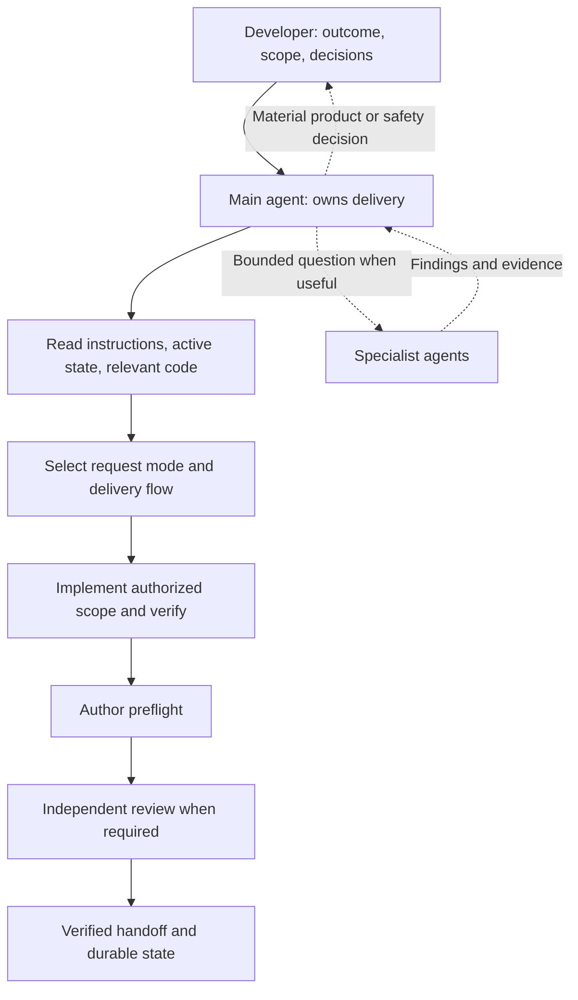
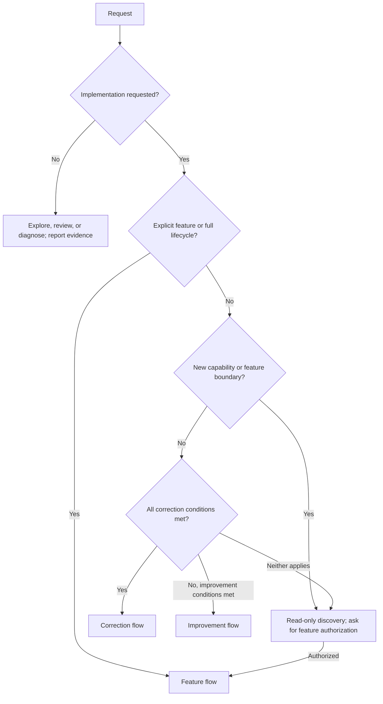
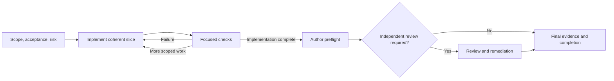
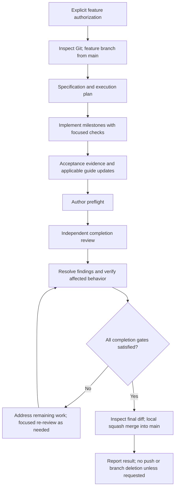
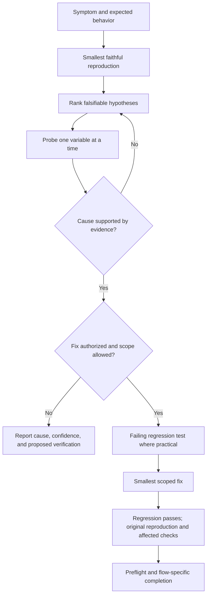
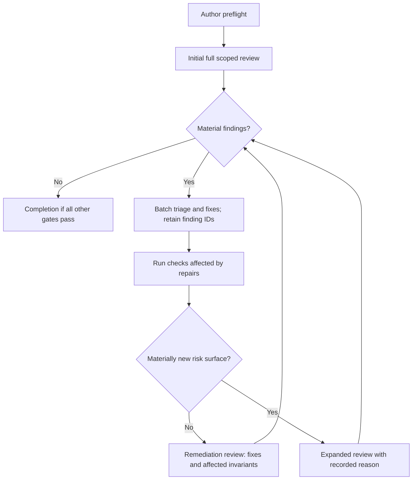
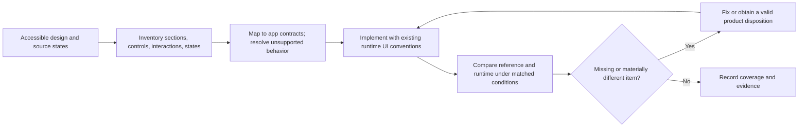

# Agentic development handbook

This handbook explains how work moves from your request to a verified result in
Languon, what each agent does, and how to write prompts that avoid unnecessary
work without sacrificing quality. Start with the flow selector, then copy the
prompt closest to your situation.

This is a human-facing explanation, not a second policy engine.
[AGENTS.md](../AGENTS.md) owns authorization, classification, safety, and Git
rules; [shared delivery](../.agent/DELIVERY.md) owns the execution procedure.
Use the [development reference](./agentic-development.md) for setup and exact
verification recipes, and the [skills guide](./agent-skills.md) for skill
invocation and provenance. If these explanations drift, the authoritative
instructions take precedence and this handbook should be corrected.

## 1. The mental model

You supply the outcome, scope, constraints, and product decisions. The main
agent discovers the relevant implementation, selects a delivery flow, maintains
durable state, implements the change, and establishes evidence that it works.
Specialist agents help with bounded questions when their independent context is
useful; they are not a mandatory procession for every task.

A **skill** is a reusable procedure, such as frontend implementation or bug
diagnosis. An **agent** is an execution context with a role and permissions.
Reading a testing skill does not automatically mean spawning a tester. A
reviewer can assess existing test evidence without rerunning every command.



Autonomy means the agent continues through normal implementation and repair
without asking you to approve each milestone. It does not mean permission to
invent product behavior, change security policy, use production data, push code,
or perform destructive operations. “Do not stop until done” does not expand the
authorized scope.

## 2. Choose the request mode before the delivery flow

First distinguish **understanding work** from **changing work**. “Explain,”
“review,” and “diagnose” authorize inspection and relevant safe diagnostics, not
implementation. “Fix,” “implement,” and “change” authorize implementation within
the repository's classification and safety boundaries.

There are three delivery flows, not four. A bug fix uses correction,
improvement, or explicitly authorized feature delivery depending on its actual
scope. Diagnosis is a technique or a standalone read-only request.



| Flow        | Typical outcome                                                                           | Durable record                                   | Default Git behavior                                                    |
| ----------- | ----------------------------------------------------------------------------------------- | ------------------------------------------------ | ----------------------------------------------------------------------- |
| Correction  | Fix established validation, correct copy, adjust one bounded screen detail                | One `.agent/corrections/<slug>.md`               | Current branch; no automatic commit or merge                            |
| Improvement | Cohesive tooling enhancement, bounded internal refactor, existing-contract UX enhancement | One `.agent/improvements/<slug>.md`              | Current branch; no automatic commit or merge                            |
| Feature     | Explicitly requested new capability, journey, integration, or full lifecycle              | Four files under `.agent/features/<NNN>-<slug>/` | `feature/<slug>` from `main`; verified local squash merge on completion |

The table is a guide, not a replacement for root classification. File count is
not the deciding factor: a one-line authorization-policy change can cross a
feature boundary, while a tooling improvement can touch many files. Changes to
public contracts, persisted schema, production dependencies, deployment, or
material architecture also require checking feature authorization.

An improvement may introduce a necessary development dependency; it does not
authorize a production dependency. An ordinary established-behavior bug is not
automatically a feature just because it needs debugging. A correction that grows
into a qualifying improvement can escalate with a linked successor record;
crossing a feature boundary requires explicit authorization first.

## 3. What the agents actually do

The main agent remains accountable for the integrated result. Delegation does
not transfer product authority or make a specialist's answer automatically true.

| Role                  | Useful assignment                                                | Expected output and boundary                                                               |
| --------------------- | ---------------------------------------------------------------- | ------------------------------------------------------------------------------------------ |
| Main agent            | Own the authorized outcome end to end                            | Scope, implementation, integration, evidence, active state, final report                   |
| Explorer              | Find the actual execution path or comparable implementation      | Relevant paths, facts, dependencies, and uncertainties; read-only                          |
| Product owner         | Clarify acceptance, edge cases, and competing interpretations    | Product questions and specification analysis; read-only, no invented decisions             |
| Architect             | Evaluate a consequential module boundary or design alternative   | Alternatives, tradeoffs, constraints, and recommendation; read-only                        |
| Implementation worker | Implement a bounded independent slice when delegated             | Changes within explicit file or module ownership; preserve other agents' work              |
| Reviewer              | Independently assess the scoped implementation and test coverage | Severity-ranked findings, locations, impact, fixes, and evidence gaps; read-only           |
| Tester                | Resolve a concrete verification question                         | Focused results and coverage gaps; test edits only when delegated, no product-source edits |
| Security reviewer     | Assess a materially affected trust or sensitive-data surface     | Threats, exploit conditions, impact, and required mitigations; read-only                   |

Repository specialist configurations live in [`.codex/agents`](../.codex/agents).
Role choice matters more than running every role. For example, a label correction
normally needs the main agent and a rendered-label check, not an architect,
product owner, tester, and reviewer each rereading the repository.

A useful delegation contains one question, relevant source/specification paths,
the exact diff boundary, available evidence, and the requested output. Parallel
work is useful for independent questions or non-overlapping implementation;
parallel edits to the same surface usually create integration cost.

## 4. The shared delivery loop

Every implementation flow uses the same core sequence. Its record size and
review requirements differ, not its obligation to prove the outcome.



**Scope and risk.** The agent reads applicable instructions and active state,
checks relevant ADRs and user-flow mappings, and writes observable acceptance
criteria. “Looks good” is weaker than “the empty state, populated list, and delete
confirmation all match the supplied reference.” Scope determines what to build;
risk determines the proof and specialists needed.

**Implementation.** Work proceeds in coherent slices with focused checks while
the code is still easy to reason about. A slice is not automatically an
independent-review checkpoint. Failures are investigated rather than hidden by
weakening tests or adding unrelated changes.

**Author preflight.** Before handoff or independent review, the author maps
acceptance items to implementation and evidence, checks relevant edge states,
reviews the final diff, reconciles documentation, and removes temporary work.
This prevents a reviewer from spending a full pass rediscovering unfinished
implementation that the author already could have identified.

**Completion.** All required proof must apply to the final patch. Known material
defects and missing required evidence are not converted into success by a green
build, a screenshot, or reaching a review-count limit.

### Correction and improvement in practice

For a correction, keep scope, plan, decisions, tests, review decisions, and
remaining risks in one record. A known validation bug may need a focused
regression test and affected checks; a visible copy fix also needs a small real
browser/device observation. Neither automatically needs a full repository run.

An improvement uses the same loop and one record, but can encompass a larger
cohesive outcome, such as standardizing developer tooling. Record rollout or
removal notes where relevant. Do not create feature milestones merely because
several files change. Independent review is driven by risk, uncertainty, blast
radius, or your explicit request in both lightweight flows.

### Feature delivery in practice



The feature workflow authorizes its necessary local commits. Preserve unrelated
dirty work when preparing the branch; do not reset it to make branch setup easy.
Conflict resolution requires rerunning affected checks. A verified feature is
squash-merged locally as one commit, not regular-merged or rebased onto `main`.

The four artifacts deliberately have different jobs:

| Artifact       | What belongs there                                                            |
| -------------- | ----------------------------------------------------------------------------- |
| `FEATURE.md`   | Outcome, scope, stable acceptance IDs, design inventory, approved deviations  |
| `EXEC_PLAN.md` | Current milestones, progress, decisions, discoveries, next action             |
| `EVIDENCE.md`  | Exact checks, tested state, results, acceptance-to-proof mapping, limitations |
| `REVIEW.md`    | Reviewed boundary and mode, stable finding IDs, dispositions, final verdict   |

Link acceptance IDs and evidence rather than copying the entire specification
into every artifact. A feature with an executable journey normally needs an
applicable user-flow guide and mapped E2E coverage; record a concrete reason when
none applies. Existing guides change with affected behavior or commands in
lighter flows too. See [user-flow guidance](./user-flows/README.md).

## 5. Bug investigation and fixes

A clear, reproducible bug with an established cause can go directly through a
bounded correction. Difficult failures benefit from the diagnosing-bugs skill:
intermittent behavior, races, performance regressions, cross-boundary failures,
or cases where a passing test does not reproduce the reported symptom.



The reproduction should catch your actual symptom, not a nearby error. For a
flaky issue, record observed frequency rather than saying a single successful
run proves the race is fixed. If the environment cannot reproduce the problem,
the agent should state that limit and continue safe inspection, not invent a
root cause. Diagnosis-only work ends with evidence and a proposed fix, not code
changes. Remove temporary instrumentation after an authorized implementation.

## 6. Review without endless full-review loops

Features require one initial independent completion review **after author
preflight**, not after every implementation task. This review covers the entire
scoped diff and relevant callers, contracts, acceptance requirements, and tests.
It is not limited to the author's list of likely problem areas.



Fix valid findings together where practical. A remediation review checks the
repair, affected callers/invariants, and supporting evidence. It is narrower
than restarting the original review, but must still address newly discovered
material defects. Expand the scope when repairs materially change the risk
surface, not simply because another review round begins.

After two remediation cycles that keep producing material findings, diagnose
the process failure before another cycle: incomplete acceptance, oversized scope,
missing test seams, or unresolved architecture. This is an intervention point,
not a two-review cap. Critical/high and material security findings must be
resolved; relevant medium findings must be resolved or explicitly justified.

A separate tester is required for substantial new test harnesses, unresolved
concurrency/infrastructure behavior, or complex cross-application journeys that
need independent verification expertise. A green new harness does not waive
that trigger. Otherwise the reviewer can assess valid existing test evidence.

Security review is independently triggered by material effects on areas such as
authentication, authorization, uploads, payments, external URLs, secrets,
cryptography, personal data, SQL, HTML rendering, model tools, or webhooks.
Touching a file with one of these names alone is not the trigger; changing its
relevant behavior is. Reviewers report evidence-backed findings, not filler or
formatter-only comments.

## 7. Preserving a Magic Patterns design

### Before design: translate backend capability into a UX brief

When the backend is ready and you want to design its UI, explicitly invoke
`$design-brief` with the active record and your Magic Patterns design-system
reference. This optional skill produces a portable design prompt with short app
context, fuller feature/journey description, required controls and applicable
states, UX direction, and exclusions. It also produces stable UI requirement
IDs with source references, distinguishing supported behavior, recommendations,
and open product decisions. Source inspection is not claimed as executed proof.

It does not automatically run after every task, create a remote design, modify
backend/frontend code, or add a mandatory agent. For a changed user-visible
contract, request an update that preserves IDs and returns a delta prompt;
invisible refactoring needs no design update. Briefs are saved by default under
[docs/design-prompt](./design-prompt/README.md), with links to their feature or
other work records, implementation sources, and relevant ADRs. Explicit
response-only requests or alternate output paths override the default.

You paste the prompt into Magic Patterns using your existing design system.
When the design returns, reconcile its sections and states against the UI IDs,
then link them to the implementation's source inventory and runtime evidence.
This catches omissions during design generation as well as during integration.
It does not replace feature acceptance or allow an unfinished frontend to be
marked complete. See the [prompt cookbook](./agentic-prompts.md) for the complete
backend-first sequence, correction updates, and other common task prompts.

### After design: preserve the source through implementation

“Implement this design” is not merely “use similar colors.” Its in-scope content,
controls, hierarchy, responsive behavior, and states are acceptance requirements.
Prototype code is a design specification to adapt to the app's supported
architecture and real product contracts, not code to paste blindly.



Before coding, inventory visible sections and less obvious states: open dialogs,
menus, empty and populated content, errors, loading, permission restrictions,
and mobile layouts where the source specifies them. Give each item an ID and
track its implementation and verification. For example:

| Source item               | Implementation expectation                               | Evidence expectation                                 |
| ------------------------- | -------------------------------------------------------- | ---------------------------------------------------- |
| Empty list call to action | Present with supported navigation                        | Rendered empty-state observation                     |
| Row actions menu          | Same in-scope actions, accessible interaction            | Open-menu and action behavior check                  |
| Delete confirmation       | Dialog content, cancel, pending, failure where specified | Corresponding runtime states and regression coverage |
| Narrow layout             | Required content remains available without clipping      | Matched narrow-viewport comparison                   |

Compare like with like: viewport, theme, locale, data, and interaction state.
A populated desktop screenshot does not prove that the mobile empty state or
confirmation dialog survived integration.

If a source button implies an unsupported backend capability, the agent must not
silently omit it or fake a successful action. Resolve its intended disposition
with existing authoritative product requirements or the user; new capability
may need feature authorization. Missing design access blocks a fidelity claim,
not unrelated safe progress. Ask for source/export access rather than declaring
an incomplete reconstruction faithful.

## 8. Verification: spend on evidence, not repetition

The cheapest reliable proof depends on the failure mode. Pure transformations
usually benefit from focused unit tests; persistence invariants need disposable
database/cache evidence; journeys need appropriate integration or E2E checks;
visual behavior needs the running interface.

Every user-visible app change requires real browser/device verification under
[ADR-0016](./adr/0016-runtime-ui-kit-authority.md), including a copy correction.
Scale it: observing one rendered label can be enough for a typo. This does not
automatically require a broad E2E suite. Browser exploration does not replace
repeatable E2E coverage, and compilation does not replace either. Use the
project browser wrapper and its safety restrictions for web/admin work.

Reuse earlier evidence only after checking that relevant source, tests,
configuration, dependencies, environment, and shared consumers remain valid.
Record exact commands and the tested patch/environment; `HEAD` alone cannot
identify uncommitted changes. A small repair may invalidate one test result,
while a shared API or configuration change may invalidate a much larger set.

Documentation-only explanations such as this handbook need documentation checks,
not invented application-runtime evidence. If a required layer cannot run,
record the missing proof explicitly rather than relabeling it unnecessary.

## 9. How to write an efficient prompt

Give the agent enough information to distinguish success from a plausible but
wrong implementation. You rarely need to repeat the repository instructions or
list every specialist skill.

```text
Mode: diagnose / review / implement; explicitly say feature when intended.
Outcome: what should become possible or behave differently, and for whom.
Context: relevant route, file, active record, design link, or reproduction.
Scope: what is included and what must remain unchanged.
Acceptance: observable examples of success, including important edge states.
Constraints: compatibility, product decisions, and forbidden changes.
Verification: any specific proof needed beyond the repository defaults.
```

Use paths and links instead of pasting long histories. Include a failing command
or redacted reproduction when available. State genuinely important constraints,
not speculative implementation details. Do not paste credentials or real user
data. Replace placeholders in the examples below before sending them.

### A. Small correction

```text
Correct the misspelled label "Notifcations" on <route> to "Notifications".
Keep its styling and behavior unchanged. Use the correction flow and verify the
rendered label with the smallest relevant browser check. Do not commit.
```

Why this works: it defines one outcome and preserves a lightweight flow without
accidentally waiving required visual evidence.

### B. Reproducible established-behavior bug

```text
Fix this existing-behavior bug on <route>:
Steps: <minimal steps using fake data>.
Actual: <observed result>.
Expected: <existing contract or previously working behavior>.
Reproduction: <failing command or redacted evidence>.
Keep the public contract unchanged. Add the smallest reliable regression
coverage and verify the original reproduction. Avoid unrelated refactors.
```

Why this works: the agent can classify the actual fix and test the symptom. You
need not demand the full feature lifecycle for an ordinary bug.

### C. Unclear or intermittent bug: diagnosis only

```text
Diagnose why <symptom> occurs under <conditions>. It happens approximately
<frequency>; the last known working state is <revision or date if known>.
Use <redacted evidence or local reproduction>. Do not implement a fix or edit
files. Report the causal chain, evidence, confidence, and smallest proposed fix.
```

If you want implementation too, replace the final two sentences with: “Diagnose
and fix the issue within established behavior. Verify the original reproduction
and relevant regressions; ask before crossing a feature boundary.”

### D. Focused improvement

```text
Improve the layout of <existing screen> so <specific usability problem> is
resolved. Preserve existing actions, routes, permissions, and data contracts.
In scope: <regions and states>. Out of scope: new capabilities and redesign of
other screens. Use the improvement flow with proportional checks and review
based on actual risk. Do not commit.
```

For tooling work, replace the screen outcome with a precise developer outcome,
such as consistent formatting in named workspaces, and state any allowed
development-dependency scope. Do not use “clean up everything” as acceptance.

### E. New feature, fully delivered

```text
Create a feature using the full feature lifecycle: <name and user outcome>.
Users should be able to <journey>.
Acceptance: <observable success, failure, and permission cases>.
Out of scope: <explicit exclusions>.
Relevant context: <paths, product decisions, references>.
Continue through implementation, required verification, independent completion
review, remediation, and the repository's local squash-merge workflow.
Do not push or delete branches. Ask only for material product/safety decisions.
```

This explicitly authorizes feature delivery; it does not preapprove strategic
ADRs, destructive operations, or unspecified product choices. Resolve those
when they become concrete rather than guessing.

### F. Faithful Magic Patterns integration

```text
Implement <design link or exported source> on <route> in fidelity mode.
Preserve its in-scope sections, controls, hierarchy, interactions, responsive
layouts, and states, including <important hidden or empty states>.
Inventory source coverage before coding and compare reference/runtime evidence
under matching conditions before handoff. Adapt to existing app contracts.
Do not silently omit UI or fake unsupported actions; surface product decisions.
This request covers existing capability only. Ask before adding new capability.
```

If the design intentionally introduces a new journey, instead explicitly request
a feature and describe that journey. Saying “make it close enough” when you need
fidelity removes a useful acceptance boundary.

### G. Independent review without implementation

```text
Review <exact base/head or identified working-tree patch> against <spec path>.
Do not edit files. Assess correctness, acceptance gaps, regression risk, relevant
architecture/security concerns, and test coverage. Use valid existing evidence
before repeating checks. Report findings with severity, location, impact, and
suggested fix; state remaining gaps even if no defects are found.
```

After fixes, request: “Perform remediation review for findings <IDs> against
<reviewed patch and repair diff>. Check the repairs and affected callers,
invariants, and evidence. Expand only if the risk surface materially changed.”

### H. Explore or plan before authorizing changes

```text
Explore how <behavior> currently works and compare <bounded alternatives>.
Do not edit files or start feature delivery. Identify relevant execution paths,
constraints, risks, and the smallest recommended scope. List only decisions
that genuinely require my input.
```

Use this when the product choice is not settled. It avoids paying for a detailed
implementation that you then reject because the underlying outcome was wrong.

### I. Resume existing work

```text
Resume <active correction/improvement record or feature directory>.
Read current durable state and inspect Git status/diff before continuing.
Continue the remaining authorized work; preserve unrelated changes and reuse
only evidence still valid for the final patch. Do not restart completed phases.
```

This is better than replaying the entire old conversation. The specification
and current plan point to the evidence and review entries that matter now.

### J. Commit a completed lightweight change

```text
Inspect and commit only the completed changes for <record/path and outcome>.
Preserve unrelated working-tree changes. Confirm relevant recorded checks still
apply; use a focused imperative commit subject. Do not push.
```

Commit permission is separate from a correction/improvement implementation
request. When the working tree contains several tasks, identify the intended
change instead of asking to commit everything indiscriminately.

## 10. Common expensive prompt patterns

| Avoid                                                       | Use instead                                                                 |
| ----------------------------------------------------------- | --------------------------------------------------------------------------- |
| “Use all agents and all skills.”                            | State the outcome; delegate bounded questions when useful.                  |
| “Review after every task until perfect.”                    | Focused author checks, one initial completion review, targeted remediation. |
| “Run everything after every edit.”                          | Verify affected behavior; broaden when shared contracts or risk justify it. |
| “Save tokens by skipping browser checks.”                   | Keep the required layer, reduce it to the relevant rendered state.          |
| “Implement this screenshot.” with no access or state detail | Provide accessible source and identify important states and scope.          |
| “Fix it.” with no symptom or expectation                    | Include reproduction, actual result, expected contract, and fake data.      |
| “Just a small change” for a new permission or schema        | Explicitly authorize feature delivery and describe intended semantics.      |
| A full old chat pasted into every delegate                  | Relevant paths, exact question, patch boundary, and available evidence.     |

## 11. How to judge whether the workflow is improving

Measure complete outcomes, not just the first implementation response. A cheaper
first pass is not an improvement if you spend the savings asking for missing UI
or repairing regressions later.

For comparable tasks, record first-pass acceptance, missing design inventory
items, escaped defects, required evidence gaps, review/remediation cycles,
developer interventions, elapsed time, and total token/cost usage when available.
Include specialist agents and repair work. Unknown usage is unavailable, not zero.
Keep model, environment, task scope, and starting state comparable when evaluating
workflow changes; small samples do not establish causal savings.

Use the [evaluation protocol](./agentic-workflow-evaluation.md) and optional
[metrics template](../.agent/templates/WORKFLOW_METRICS.md) for a pilot. Protect
quality gates first, then compare cost. Decision probes test whether an agent
selects the right flow; they do not by themselves prove actual implementation
quality or token savings. No automatic paid evaluation or session-log collection
is required for ordinary delivery.

At handoff, you should be able to answer: What changed? Which acceptance items
are satisfied? What proof applies to this patch? What remains uncertain? Where
is the durable record? Was the Git action actually authorized? A short final
message can answer these questions by linking precise evidence rather than
repeating the entire work log.
